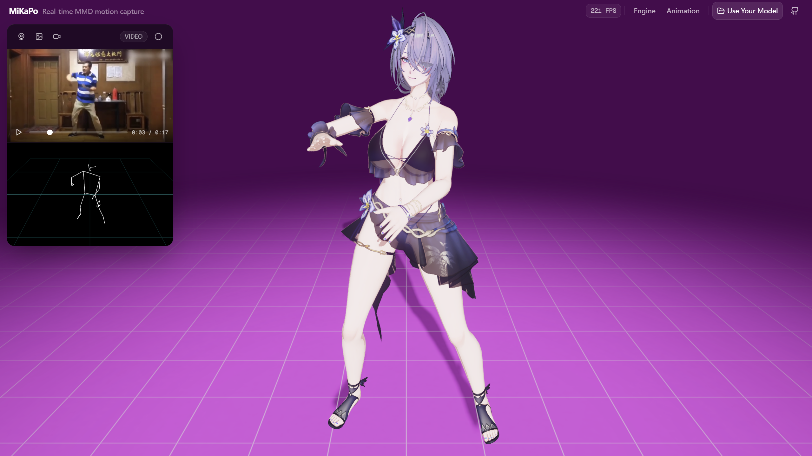
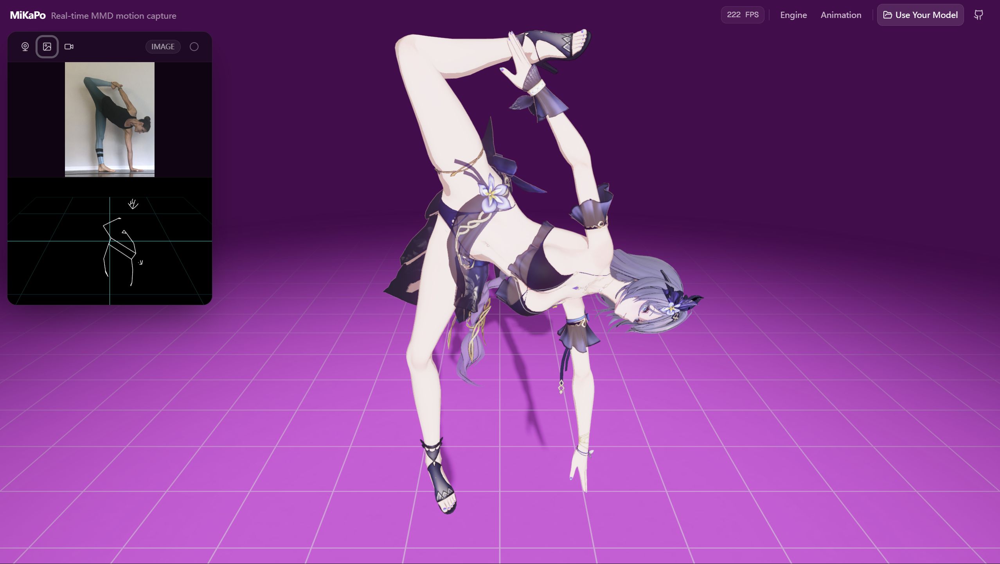
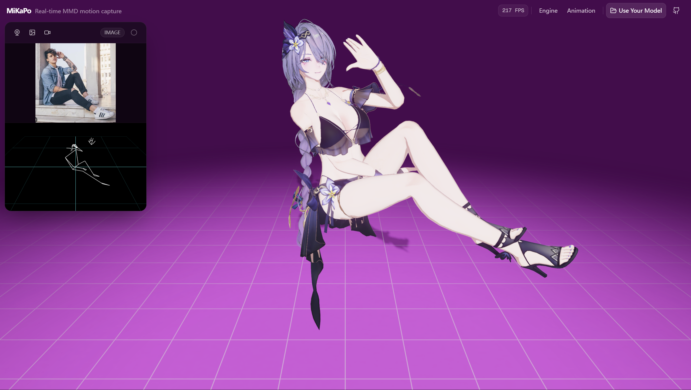
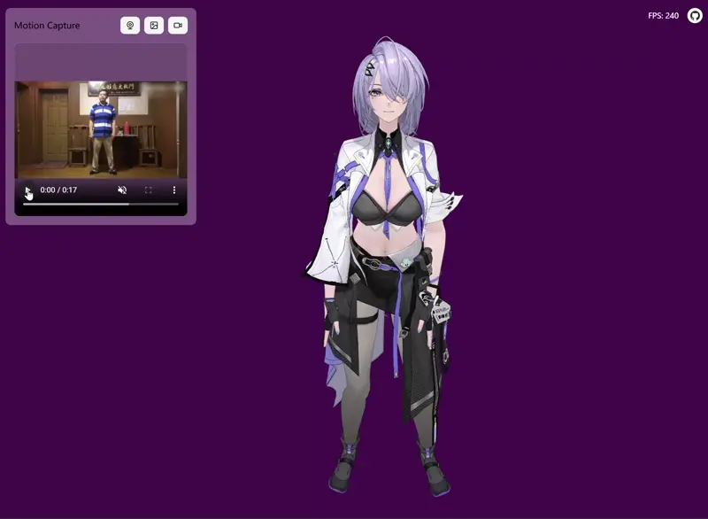

# MiKaPo: Real-time MMD Motion Capture

A web-based tool that drives MikuMikuDance (MMD) models — **full body, both hands, and face** — from a webcam, video, or photo in real time. One shot, no offline preprocessing, no multi-pass.

## Overview

[MiKaPo](https://mikapo.vercel.app) covers all three motion modalities in one pipeline:

- **Body and hands** are driven by MMD **bone rotations** — 3D landmarks from MediaPipe are mapped to per-bone quaternions in each bone's parent-local frame.
- **Face is driven by MMD morphs**, not bone retargeting — face blendshapes from MediaPipe are converted directly into MMD morph weights (`まばたき`, `あ`, `ワ`, `ウィンク`, `ウィンク右`), which is how MMD models are natively rigged for facial expression. Eye direction is the one face channel that does drive bones (`左目` / `右目`).

The hard part isn't detection — it's the transformation. MediaPipe and MMD use different coordinate systems, every MMD model has its own rest-pose reference directions, and the bone hierarchy means each rotation has to be computed in its parent chain's local space.

**MiKaPo 2.0** is a complete rewrite of the solver:

- Hierarchical bone solver with per-frame parent-chain transforms
- Auto-calibration from each loaded model's rest pose — no hardcoded reference vectors
- One-Euro filter for jitter reduction without lag
- Swing-twist quaternion decomposition for clean forearm rotation
- Migrated from Vite → Next.js
- Renderer migrated from [babylon-mmd](https://github.com/noname0310/babylon-mmd) to my custom WebGPU MMD renderer [Reze Engine](https://github.com/AmyangXYZ/reze-engine)







Demo model: 深空之眼 - 裁暗之锋·塞尔凯特

## Features

- **Holistic capture** — body pose, both hands (21 points each), and face all run through one MediaPipe HolisticLandmarker pass
- **Body & hands → MMD bones** — 33-point pose drives upper/lower body, arms, legs, and per-finger phalanges; forearm twist via swing-twist decomposition
- **Face → MMD morphs** — face blendshapes convert directly to native MMD morph weights (`まばたき`, `あ`, `ワ`, `ウィンク`, `ウィンク右`); eye gaze drives `左目` / `右目` bones
- **Per-model calibration** — reference directions derived from each loaded MMD's rest pose at load time, so swapping models works without a config file
- **Three input modes** — webcam (live), uploaded video, single image
- **Custom model upload** — drop a PMX folder to swap the default avatar
- **VMD export** — record live capture to a standard MMD `.vmd` motion file (30fps)
- **WebGPU rendering** via [Reze Engine](https://github.com/AmyangXYZ/reze-engine)

## Stack

- **Detection** — [MediaPipe HolisticLandmarker](https://ai.google.dev/edge/mediapipe/solutions/vision/holistic_landmarker)
- **Renderer** — [Reze Engine](https://github.com/AmyangXYZ/reze-engine) (custom WebGPU MMD)
- **Framework** — [Next.js 15](https://nextjs.org/)
- **UI** — Tailwind v4 + shadcn/ui

## Run locally

```bash
npm install
npm run dev
```

Then open [http://localhost:4000](http://localhost:4000).

## How the solver works

MediaPipe gives world-space 3D landmark positions per frame. MMD bones rotate in their parent's local frame, with each model defining its own rest orientation. The solver bridges these:

1. **Calibrate (once, on model load)** — read each rest-pose bone world position from the loaded MMD. Since the bone chain is identity at rest, world-space `parent → child` direction equals the parent-local reference direction.
2. **Solve (per frame, per bone)** — compose the parent chain into a single quaternion, invert to get world-to-parent-local, transform the runtime landmarks into that frame, then rotate the calibrated reference onto the live direction.
3. **Smooth** — pass each output quaternion through a [One-Euro filter](https://gery.casiez.net/1euro/) to remove jitter without lag.

```typescript
function solveBone(name: string, parentChain: string[], landmarks): Quaternion {
  // Compose parent rotations and invert to get world → parent-local
  const parentQ = parentChain.reduce((acc, p) => acc.multiply(boneStates[p].rotation), Quaternion.Identity())
  const worldToLocal = Matrix.FromQuaternion(parentQ).invert()

  // Transform landmarks into parent-local space
  const head = Vector3.TransformCoordinates(landmarks.head, worldToLocal)
  const tail = Vector3.TransformCoordinates(landmarks.tail, worldToLocal)
  const direction = tail.subtract(head).normalize()

  // Rotate the rest-pose reference onto the runtime direction
  const reference = calibratedRefs[name] ?? DEFAULT_REFS[name]
  return Quaternion.FromUnitVectorsToRef(reference, direction, new Quaternion())
}
```

### Notable cases

- **Forearm twist** (`左手捩` / `右手捩`) — uses swing-twist decomposition along the elbow's forearm axis. A naive Euler-based approach bleeds wrist roll into pitch/yaw and gimbals.
- **Lower body bend** (`下半身`) — 3-axis Gram-Schmidt basis from hip line + spine direction so the pelvis tilts forward when leaning, instead of staying vertical and kinking the spine at the waist.
- **Head** (`頭`) — single rotation matrix from a Gram-Schmidt basis (ear axis + ear→eye direction) decomposed to a quaternion, instead of two `FromUnitVectors` calls composed (which compounds error).
- **Ankle** (`左足首` / `右足首`) — calibrated from the `足首 → つま先` bone direction; runtime uses `ankle → foot_index` landmarks (not heel) so the rest and runtime measurement frames line up.
