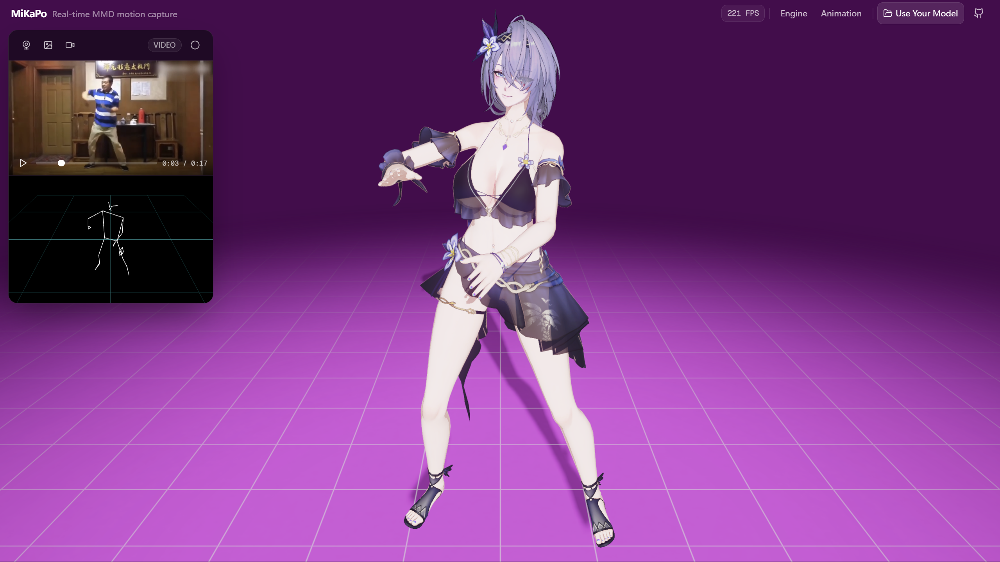
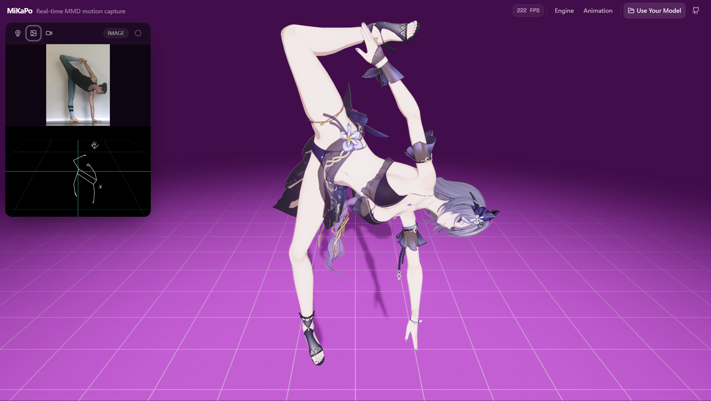
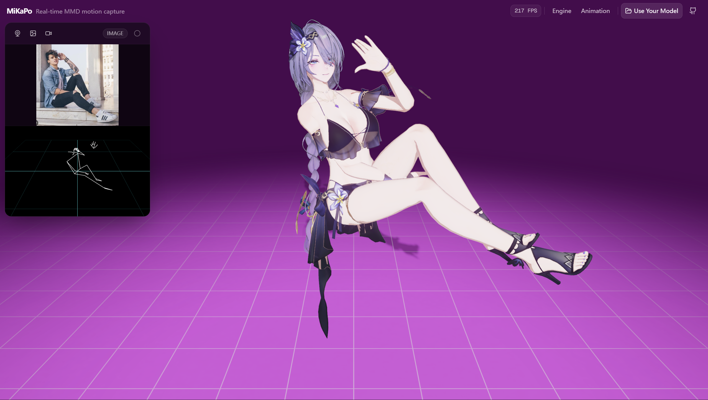
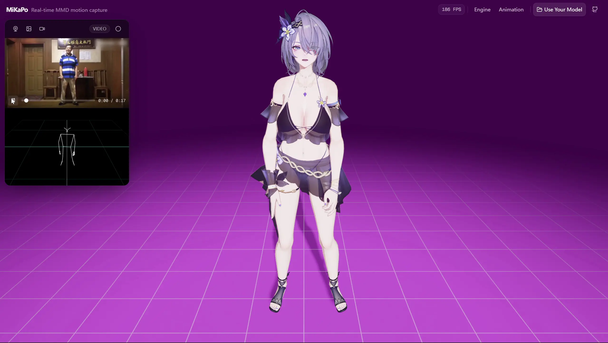
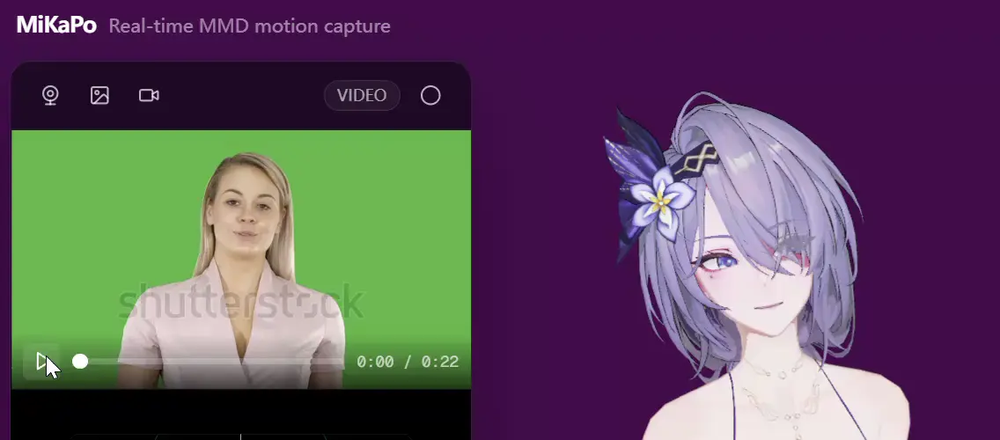

# REZE MIPO: Real-time MMD Motion Capture

*(previously MiKaPo)*

A web-based tool that drives MikuMikuDance (MMD) models — **full body, both hands, and face** — from a webcam, video, or photo in real time. One shot, no offline preprocessing, no multi-pass.

One piece of the **Reze MMD family**, covering the whole MMD workflow on the web:

|                                                           |                                                                                |
| --------------------------------------------------------- | ------------------------------------------------------------------------------ |
| [reze-engine](https://github.com/AmyangXYZ/reze-engine)   | The WebGPU foundation — anime-character rendering and physics, dependency-free |
| [reze-design](https://github.com/AmyangXYZ/reze-design)   | Scene design, rendering and sharing platform                                   |
| [reze-studio](https://github.com/AmyangXYZ/reze-studio)   | Animation editing on a professional timeline and curve editor                  |
| **Reze MiPo**                                             | This repo — real-time motion capture in the browser, exporting straight to VMD |
| [reze-rig](https://github.com/AmyangXYZ/reze-rig)         | Retarget FBX animations to MMD VMD format, Mixamo and Unity tested             |

[Try it](https://mikapo.reze.one) · Demo model: 深空之眼 - 裁暗之锋·塞尔凯特

## The idea

**Detection is a solved problem you can download. The transformation is the product.**

MediaPipe hands you 33 body points, 21 per hand, and a face mesh, as 3D positions in a world whose origin is the subject's hip. MMD wants something categorically different: a **quaternion per bone, expressed in that bone's parent's local frame**, on a skeleton whose rest pose belongs to whoever modelled the character. Nothing in the landmark stream tells you what a shoulder's rotation is; it only tells you where an elbow ended up.

Everything interesting lives in that gap. The three facts that shape the whole solver:

1. **A direction is not a rotation.** A landmark pair gives you where a bone points, and a bone that points somewhere can still be spun about its own axis — roll is unobservable from a segment, and shortest-arc solving silently invents it.
2. **Depth is a guess, and the hips are the origin.** MediaPipe measures x/y from the image and infers z; the z channel is the noisy one, and because the coordinates are hip-centred, the pelvis's own translation is the one quantity that has been subtracted out entirely.
3. **The model is not the person.** Every MMD character has its own rest directions, its own proportions, and its own idea of where the floor is. A rotation that is correct for a person is wrong for the model unless it is measured against that model's own bind pose.

So the solver is one generic pipeline over a **bone-definition table** — each row naming a bone, its parent, and the two landmarks whose difference points it — with per-model calibration in front of it and physical plausibility behind it. That table is the entire configuration: there are no hand-written per-bone functions to keep in sync.

```typescript
// One row of the table drives the generic solver:
{ kind: "direction", name: "左ひじ", parent: "左腕", source: "pose",
  from: "left_elbow", to: "left_wrist" }

function solveDirection(def, out: Quat): boolean {
  const dir = landmarkDelta(def.source, def.from, def.to)     // world-space segment
  rotateVecInv(worlds[def.parent], dir, dir)                  // → parent-local (conjugate, no matrix)
  quatFromUnitVectors(getRef(def.name), dir.normalize(), out) // rest ref → live direction
  // then: optional roll witness (arms/legs), anatomical clamp (fingers)
}
```

**Calibration is what makes it model-agnostic.** At rest, every parent chain is identity — so the world-space `parent → child` direction *is* the parent-local reference direction. Read those once when a model loads and the same table drives any PMX, with no config file and no T-pose ceremony from the user.

**The parent chain is computed once.** Bones are solved in hierarchy order, each one composing its world rotation from its parent's, so a chain product is never recomputed and rotating into parent-local space is a quaternion conjugation rather than a matrix inverse. The per-frame solve allocates nothing.

## The tricks

The parts that took measurement rather than reasoning:

- **Roll needs a witness.** The elbow tells you where the upper arm *points*; only the forearm's direction tells you how the arm is *twisted*. Each arm and thigh names a child segment as its roll witness, and the solve builds full rest and live orthonormal bases from it — but only to the extent the roll is actually observable, faded by the sine of the child joint's bend angle. A straight limb reports no roll, so the fade returns to shortest-arc rather than to noise. Thighs get a second witness, the foot: with the knee extended the shin cannot twist independently, so where the toes point is where the femur is rotated.
- **Roll is also the noisiest channel, and invisible in a landmark preview.** Near a straight limb the witness's perpendicular lever is short, so a centimetre of landmark noise becomes degrees of spin — and because roll changes no bone *direction*, a debug skeleton looks perfectly clean while the character's flesh shimmers. Arms and thighs decompose into swing and twist about their rest axis, and the twist alone runs through a much calmer filter before being recomposed.
- **Distrust z as policy.** Every landmark's z channel gets its own low-pass before solving, while x and y pass through untouched. Front-back torso wobble is almost entirely z noise on the shoulder and hip lines: filtering that one channel took the measured wobble from 6.7°/frame to 0.3°.
- **Capture is in-place, on purpose.** The pelvis translation MediaPipe deletes can be rebuilt from 2D projective geometry — the image-space spine length against the model's known spine length recovers camera distance; the hip midpoint's position recovers lateral travel. Both are implemented and verified, and both are **off by default**: the estimates drift over a session, and a capture that artists will re-edit is better with no root motion than with root motion that wanders. `センター` moves vertically only, which is what makes squats and crouches read.
- **The body is placed by its lowest part, not by its feet.** Both legs are walked forward from the hips, and the body is dropped until the *lower* foot rests at the height it rests at in the model's own bind pose — so a standing split measures against the standing foot, with no floor assumption and no contact detection to misfire. A hip-clearance candidate joins the same max(), so a body rolling on the floor rests on its hips instead of being hauled around by legs waving in the air.
- **Dropouts crossfade; they don't freeze.** A bone that loses its landmarks eases to rest over 500ms and eases back in over 250ms, cosine-shaped — holding forever is right for one dropped frame and wrong for two seconds. Hands add hysteresis on top (engage after ~1s of continuous tracking, 400ms of grace before letting go), because MediaPipe hands flicker and a three-frame hand is usually garbage. The per-tick fade step is capped, so a whiffed frame after a stall can't spend the whole fade at once.
- **A collapsed hand still has 21 valid points.** MediaPipe's hand landmarks carry no visibility field, and when tracking degrades they don't disappear — they collapse toward the origin, structurally perfect and completely wrong. Two honest signals gate them: the hand's own span (a palm is never a point) and the pose model's wrist visibility, the same joint tracked by a different model.
- **The trunk is three joints, not one.** The measured chest rotation splits evenly across `上半身` and `上半身2` (`normalize(I + R)` is exactly R^½), so the spine curves instead of hinging. `下半身` takes a quarter of the mean thigh pitch as posterior pelvic tilt, which is what makes sitting read as sitting. And the shoulder-line tilt — which the trunk basis orthogonalizes away entirely, so a shrug was previously *invisible to the solver* — is read before that happens and handed to the `肩` bones.
- **The clavicle carries its share.** Hanging `腕` straight off the chest means the humerus performs every raise alone, which is anatomically impossible past ~30° and looks it. Anatomy splits elevation roughly 2:1, so the shoulder takes a fraction of the arm's own rotation and the arm gives back exactly that much — the arm still points where the landmarks put it; only the joint that bends changes.
- **穿模 is answered with the model's own rigid bodies.** An MMD model already ships its author's approximation of the character as physics capsules. MMD never tests those against each other — they're bone-following statics, so the broadphase drops the pairs — which is precisely how a hand ends up inside a chest. The solver reads them as clearance volume and swings the shoulder just past contact, rotation only, so the pose keeps its shape.
- **Filter on true angular velocity, and refuse the impossible.** One-Euro driven by per-component quaternion derivatives adapts to a quantity that isn't a rate of anything physical, so fast poses arrive softened; measuring the actual rotation between frames gives one honest speed. On top of that sits an *acceleration* limit rather than a speed limit — a real limb ramps up over several frames while a detection glitch arrives at full speed from nothing, which is the only thing that tells them apart on the first frame.
- **Display interpolation is a playback clock, not a chase.** Results arrive ~30 Hz and the renderer runs at 60. Tweening from wherever the model currently is toward each new result is an exponential chase that never arrives; worse, restarting each segment on *arrival* lets detection jitter modulate playback speed, which reads as micro-stutter. A cursor advances along the **media** timeline by wall time, interpolating whichever pair of results brackets it, with a small latency margin and gentle rate steering. Measured against the chase: ~10ms less latency and ~7 percentage points more amplitude on fast motion.
- **Exports read the future.** Live capture must filter causally and pays lag for it; a finished take has no such excuse. A Savitzky-Golay pass fits a local polynomial rather than averaging, so shake goes without flattening a kick — 59% less jitter, 99% of peak amplitude, zero phase shift.

**Where the ceiling is now.** The solver adds roughly 7–17ms of filter latency on top of MediaPipe's ~30 Hz cadence, keeps 100% of a snap's amplitude, and filters jitter to near the landmark-noise floor. For the body, the remaining quality limit is the detector's landmarks, not the transformation. Fingers at full-body framing distance are the one place with real headroom left, and the fix is known: crop around the wrists and run a dedicated hand pass.

---

**Reze MiPo 5.0** — the solver rewritten against the best browser MMD mocap that exists, one technique at a time, each webcam-tested before the next.

- **Z-channel policy, in-place capture, FK-only legs** — see [The tricks](#the-tricks). Root travel and leg IK both left the default path: the first because it drifts, the second because two authorities per knee fight each other and an artist wants FK rotations to re-key
- **Per-bone dropout crossfades with hand hysteresis** — no more frozen limbs, no more re-acquisition pops
- **Trunk decomposition** — `上半身2` takes half the chest rotation, `下半身` tucks with thigh pitch, shrugs reach the clavicles at last
- **Roll stabilizer** — the shimmer that never showed up in the landmark preview
- **Media-timeline playback** — the display stopped chasing and started playing
- **Uploads survive a refresh** — the PMX folder and the capture video are kept in IndexedDB, one record each, restored at boot
- **Product-level UI** — a draggable, resizable capture panel, floating chrome and the design language shared with reze.design and reze.studio

**MiKaPo 4.0 *(as it was then named)*** — the point where a capture becomes motion worth keeping.

Up to 3.x this was proof that MMD mocap could run in a browser at all: a pose followed a person, live, and the file it wrote was rotations. 4.0 is about the capture being *right* — the body stands on the ground, joints bend the way joints bend, the model's own geometry keeps limbs out of itself, and a bad frame of detection is refused rather than displayed.

- **The body is placed, not just posed** — `センター` carries a height and the leg IK bones carry positions, so crouches, level changes and weight drops survive into the file. Placement is exact rather than inferred: both legs are walked forward from the hips, and the body is dropped until the **lower** foot rests at the height it rests at in the model's own bind pose. Taking the lower foot is what makes a raised leg safe — a standing split measures against the standing foot, with no floor assumption and no contact detection to misfire. What it cannot do is leave the ground: both feet airborne is indistinguishable from standing in hip-centred landmarks
- **Exports are native MMD leg rigs** — `足ＩＫ` tracks come from the solved chain and leg IK is switched on in the file, so a motion is editable the way MMD users expect instead of FK a player has to be told not to override
- **The shoulder carries its share** — the bone table hung `腕` straight off `上半身`, so the clavicle never moved and the humerus performed every raise alone, which is anatomically impossible past about 30° and looked it. Anatomy splits elevation roughly 2:1, so the clavicle now takes a share of the arm's rotation and the arm gives back exactly that much — the arm still points where the landmarks put it, only the joint that bends changes
- **穿模 answered with the model's own rigid bodies** — an MMD model already carries its author's approximation of the character as physics capsules. MMD never tests those against each other (bone-following statics, so the broadphase drops the pairs), which is exactly how a hand ends up inside a chest. The solver reads them as clearance volume and swings the shoulder just past contact, rotation only
- **Hands are gated on confidence like everything else** — MediaPipe's hand landmarks carry no visibility field, and a lost hand does not vanish: it collapses toward the origin, still 21 structurally valid points, which is what snapped a wrist to an impossible angle. Two honest signals gate them now — the hand's own span, and the pose model's wrist visibility
- **Smoothing that reads velocity, and refuses the impossible** — One-Euro's adaptive term used to be driven by per-component derivatives, which are not a rate of anything physical, so quick poses arrived softened. It measures true angular velocity now. And because a speed-adaptive filter is defenceless against a one-frame outlier — a glitch looks exactly like a fast move — rotations and positions are both held to what a limb could actually have done since the last frame, which is an acceleration limit, not a speed one: real motion ramps up, a glitch arrives from nothing
- **Exports smooth in both directions** — live capture must filter causally and pays lag for it; a finished take has no such excuse. A Savitzky-Golay pass fits a local polynomial rather than averaging, so shake goes without flattening a kick: 59% less jitter, 99% of peak amplitude kept, zero phase shift
- **Stills are stills** — the landmarker's graph is reset between images and the pose is applied unfiltered and untweened, so a second upload is its own pose rather than a transition out of the first
- **Grounding holds rather than guesses** — placement is a standing-pose idea, so once the torso leaves vertical (rolling, lying, floor work) the body keeps its last height instead of being hauled around by legs waving in the air. Monocular landmarks do not say how far a lying body dropped; a pose placed imperfectly is forgivable, one that bounces is not
- **No tuning panel** — the filter constants are the solver's business

**MiKaPo 3.2** — capture quality: the export reads the whole take, hands stop inventing poses, and the model's own body keeps limbs out of it.

- **The exported take is smoothed in both directions** — live capture must filter causally and pays lag for it; a finished take has no such excuse. Export now runs a Savitzky-Golay pass over the recorded sequence, which fits a local polynomial instead of averaging, so shake goes without flattening a kick or a snap. Measured on a synthetic take with an 80° spike: 59% less jitter, 99% of the peak amplitude kept, zero phase shift. The live One-Euro filter is unchanged — this is an extra pass the export can afford
- **Hands are gated on confidence like everything else** — MediaPipe's hand landmarks carry no visibility field, and when tracking degrades they do not vanish: they collapse toward the origin, still 21 structurally valid points. That is what snapped a wrist to an impossible angle with the hand parked at the body's centre. Two honest signals now gate them — the hand's own span (a palm is never a point) and the pose model's wrist visibility, the same joint tracked independently
- **Finger bend is measured about the bend axis** — it had been the total rotation angle wearing the axis's sign, so a splayed knuckle inflated the curl its derived joints copy, folding fingers backwards. It is the twist component now, and nothing else
- **穿模 answered with the model's own rigid bodies** — an MMD model already carries its author's approximation of the character as physics capsules, sized and placed to fit. MMD never tests those against each other (they are bone-following statics, so the broadphase drops the pairs), which is exactly how a hand ends up inside a chest. The solver reads them as clearance volume and swings the shoulder just past contact — rotation only, so the pose keeps its shape and no IK is involved
- **Video duration is resolved, not assumed** — browsers report `Infinity` at `loadedmetadata` for WebM and anything streamed. It broke the readout, broke the scrubber, and would have made the frame loop run forever

**MiKaPo 3.1** — motion export rebuilt around an offline conversion pass.

- **Video → VMD, stepped rather than recorded** — the video is seeked frame by frame at VMD's own 30 fps, detected and solved, so a slow machine produces the same file as a fast one and nothing is dropped because detection fell behind. Media time drives the One-Euro filters at exact deltas, which is what they were built for; seek and detect overlap so neither waits on the other
- **The file comes from [Reze Engine](https://github.com/AmyangXYZ/reze-engine)'s VMD writer** — the same one Reze Studio exports through, rather than a second implementation. Two bugs retired with the old one: every export had been written at half speed, and all 64 interpolation bytes were the same value, giving each keyframe a degenerate curve
- **The file carries its own IK instruction** — the engine reads and writes VMD's per-chain IK block, so an export says whether leg IK should run rather than leaving it to the player. (3.3 keyframes the IK bones and switches it on; before that the capture was FK-only and switched it off)
- **A still exports too** — a single-frame VMD, which is how MMD carries a pose
- **Tuning panel** — smoothing and responsiveness, plus blink, mouth and smile as sensitivities that all point the same way, each metered against the live signal it gates. Face capture can be switched off entirely, and writes the morphs back to rest when it is

**MiKaPo 3.0** — solver and capture pipeline rewritten by [Claude (Fable 5)](https://www.anthropic.com/claude): **60 FPS rendering with real-time capture**.

- **Web Worker detection** — MediaPipe holistic runs off the main thread; the WebGPU render loop never blocks on inference and holds 60 FPS during capture
- **Data-driven solver** — one bone-definition table + generic direction/basis/twist solvers replaced ~40 hand-written per-bone functions; parent chains computed once per frame via cached world rotations, matrix inversion replaced by quaternion conjugation, zero allocations per frame (verified bit-equivalent to the 2.0 solver, 1.7× faster)
- **Solver math on [Reze Engine](https://github.com/AmyangXYZ/reze-engine)'s Vec3/Quat** — Babylon.js remains only in the debug skeleton preview (so you can see when a bad pose comes from MediaPipe, not the solver), lazily loaded
- **Roll witnesses** — the forearm/shin direction pins upper-arm and thigh roll, so elbow creases and knee planes orient correctly instead of being left to shortest-arc chance
- **Anatomical finger clamps** — swing-twist decomposition per finger with human flexion/spread ranges; noisy landmark frames can no longer bend fingers backward
- **Visibility gating + hold-last-pose** — off-frame or occluded limbs hold their pose instead of snapping to identity or chasing garbage landmarks
- **Adaptive motion interpolation** — pose tweens are sized to the measured detection interval, upsampling ~30 Hz capture to smooth 60 FPS motion; One-Euro filters run on media time so video seeks don't warp smoothing

**MiKaPo 2.0** rewrote the solver from scratch (hierarchical parent-chain solving, rest-pose auto-calibration, One-Euro filtering, swing-twist forearm), migrated Vite → Next.js, and moved rendering from [babylon-mmd](https://github.com/noname0310/babylon-mmd) to my custom WebGPU MMD renderer [Reze Engine](https://github.com/AmyangXYZ/reze-engine).







Demo model: 深空之眼 - 裁暗之锋·塞尔凯特

## Features

- **Holistic capture** — body pose, both hands (21 points each), and face all run through one MediaPipe HolisticLandmarker pass
- **Body & hands → MMD bones** — 33-point pose drives upper/lower body, arms, legs, and per-finger phalanges; forearm twist via swing-twist decomposition
- **Face → MMD morphs** — face blendshapes convert directly to native MMD morph weights (`まばたき`, `あ`, `ワ`, `ウィンク`, `ウィンク右`); eye gaze drives `左目` / `右目` bones
- **Per-model calibration** — reference directions derived from each loaded MMD's rest pose at load time, so swapping models works without a config file
- **Three input modes** — webcam (live), uploaded video, single image
- **Custom model upload** — drop a PMX folder to swap the default avatar
- **VMD export** — record live capture to a standard MMD `.vmd` motion file (30fps)
- **WebGPU rendering** via [Reze Engine](https://github.com/AmyangXYZ/reze-engine)

## Stack

- **Detection** — [MediaPipe HolisticLandmarker](https://ai.google.dev/edge/mediapipe/solutions/vision/holistic_landmarker), running in a Web Worker
- **Renderer** — [Reze Engine](https://github.com/AmyangXYZ/reze-engine) (custom WebGPU MMD)
- **Framework** — [Next.js 16](https://nextjs.org/)
- **UI** — Tailwind v4 + shadcn/ui

## Run locally

```bash
npm install
npm run dev
```

Then open [http://localhost:4000](http://localhost:4000).

## How the solver works, step by step

See [The idea](#the-idea) for why each step exists.

1. **Calibrate (once, on model load)** — read each rest-pose bone world position from the loaded MMD. Since the bone chain is identity at rest, world-space `parent → child` direction equals the parent-local reference direction.
2. **Solve (per frame, per bone)** — each bone is one row in a definition table (parent, landmark pair, optional roll witness / anatomical clamp). World rotations accumulate down the hierarchy in solve order, so every parent chain is computed exactly once; rotating into parent-local space is a quaternion conjugation, no matrices involved.
3. **Smooth** — pass each output through a [One-Euro filter](https://gery.casiez.net/1euro/) (on media time) driven by true angular velocity, bounded by what a limb could physically have done since the last frame, then tween to display rate. Exports get a second, non-causal pass: Savitzky-Golay over the finished take, which reads future frames the live path cannot and so removes shake at zero phase shift while a polynomial fit keeps fast transients at their real amplitude.
4. **Clear the body** — the model's own rigid bodies define where an arm may not go. Depth is MediaPipe's weakest axis and its error peaks exactly when a limb crosses the torso in frame, so the solved arm is checked against those capsules and swung out at the shoulder when it is inside.
5. **Place it on the ground** — walk both legs forward from the hips, then drop the body until the lower foot rests where it rests in the model's bind pose. The legs stay FK: the walk only asks where the ankles land, so the body can be dropped onto the lower one.

### Notable cases

- **Forearm twist** (`左手捩` / `右手捩`) — uses swing-twist decomposition along the elbow's forearm axis. A naive Euler-based approach bleeds wrist roll into pitch/yaw and gimbals.
- **Lower body bend** (`下半身`) — 3-axis Gram-Schmidt basis from hip line + spine direction so the pelvis tilts forward when leaning, instead of staying vertical and kinking the spine at the waist.
- **Head** (`頭`) — single rotation matrix from a Gram-Schmidt basis (ear axis + ear→eye direction) decomposed to a quaternion, instead of two `FromUnitVectors` calls composed (which compounds error).
- **Ankle** (`左足首` / `右足首`) — calibrated from the `足首 → つま先` bone direction; runtime uses `ankle → foot_index` landmarks (not heel) so the rest and runtime measurement frames line up.
