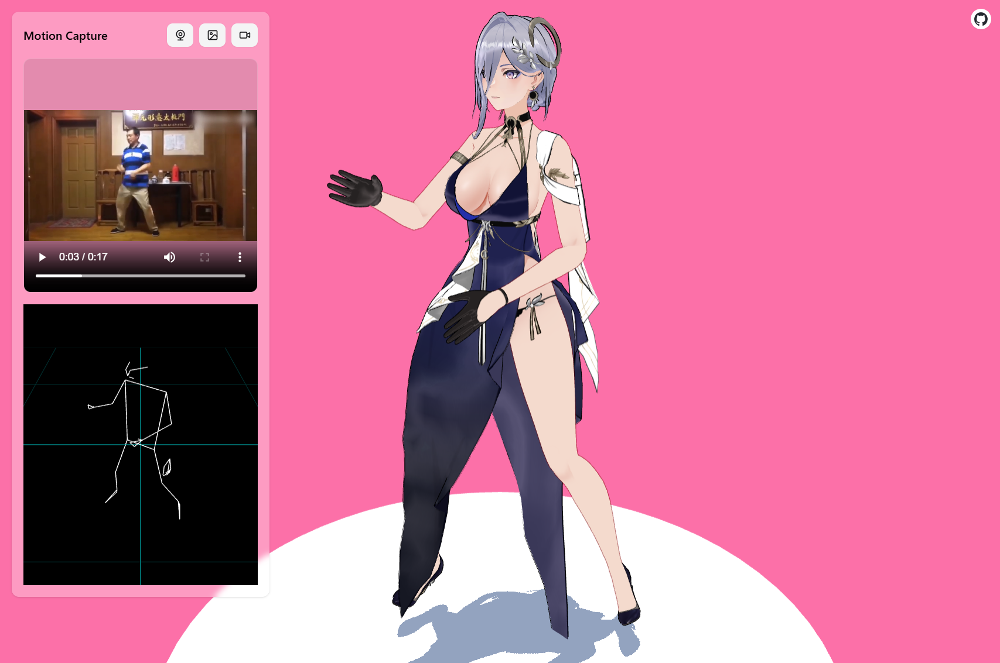

# MiKaPo: Real-time MMD Motion Capture

A web-based tool that enables real-time motion capture for MikuMikuDance (MMD) models.

## Overview

[MiKaPo](https://mikapo.vercel.app) transforms video input into real-time MMD model poses by detecting 3D landmarks and converting them to bone rotations. The core technical challenge lies in accurately mapping world-space 3D landmarks from MediaPipe to MMD bone quaternion rotations, accounting for MMD's specific bone coordinate system and directional conventions.

**MiKaPo 2.0** introduces a completely rewritten solver with hierarchical bone transformations, migrating from Vite to Next.js for improved performance and maintainability. The renderer backend is also evolved from [babylon.js](https://www.babylonjs.com/) and [babylon-mmd](https://github.com/noname0310/babylon-mmd) to my dedicate WebGPU MMD render [RezeEngine](https://github.com/AmyangXYZ/reze-engine).




Demo model: 深空之眼 - 裁暗之锋·塞尔凯特

## Key Features

- **Real-time pose detection** using MediaPipe Pose
- **Face and hand tracking** for comprehensive motion capture
- **Multiple input sources**: webcam, video files, and image uploads
- **Live MMD model rendering** with synchronized bone animations

## Technical Stack

- **3D Pose Detection**: [MediaPipe Pose Landmarker](https://ai.google.dev/edge/mediapipe/solutions/vision/pose_landmarker/web_js)
- **3D MMD Render**: [Reze-Engine](https://github.com/AmyangXYZ/reze-engine)
- **Web Framework**: [Next.js](https://nextjs.org/)

## Core Challenge

The primary technical challenge involves solving the complex transformation from world-space 3D landmarks to MMD bone quaternion rotations. This requires:

- Converting MediaPipe's coordinate system to MMD's bone space
- Handling MMD's unique bone direction conventions
- Computing accurate quaternion rotations for smooth animations
- Maintaining temporal consistency across frames

## Technical Solution

The solver implements a hierarchical transformation approach that maps MediaPipe's world-space landmarks to MMD bone rotations:

```typescript
// Key Algorithm Pseudocode
function solveBoneRotation(landmarkName: string, parentChain: string[]): Quaternion {
  // 1. Get world-space landmarks from MediaPipe
  const worldLandmark = getMediaPipeLandmark(landmarkName)
  const worldTarget = getMediaPipeLandmark(targetLandmarkName)

  // 2. Build full parent bone hierarchy chain (not just immediate parent)
  const fullParentQuat = parentChain.reduce(
    (acc, parent) => acc.multiply(boneStates[parent].rotation),
    Quaternion.Identity()
  )

  // 3. Transform world landmarks to parent's local space
  const parentMatrix = Matrix.FromQuaternion(fullParentQuat).invert()
  const localLandmark = Vector3.TransformCoordinates(worldLandmark, parentMatrix)
  const localTarget = Vector3.TransformCoordinates(worldTarget, parentMatrix)

  // 4. Calculate bone direction in local space
  const boneDirection = localTarget.subtract(localLandmark).normalize()

  // 5. Set MMD bone's default A-pose reference direction
  const mmdReferenceDirection = getMMDDefaultDirection(boneName)

  // 6. Compute quaternion rotation from reference to current direction
  return Quaternion.FromUnitVectors(referenceDirection, boneDirection)
}

// Example: Left wrist transformation chain
// Parent hierarchy: upper_body → left_arm → left_elbow → left_wrist
// Each bone's rotation is computed in its parent's local space
```

This approach ensures accurate bone rotations by:

- **Hierarchical Transformation**: Each bone is solved in its full parent chain's local space
- **MMD A-Pose Alignment**: Reference directions match MMD's default bone orientations
- **Coordinate System Conversion**: Properly handles MediaPipe's coordinate system to MMD's bone space
